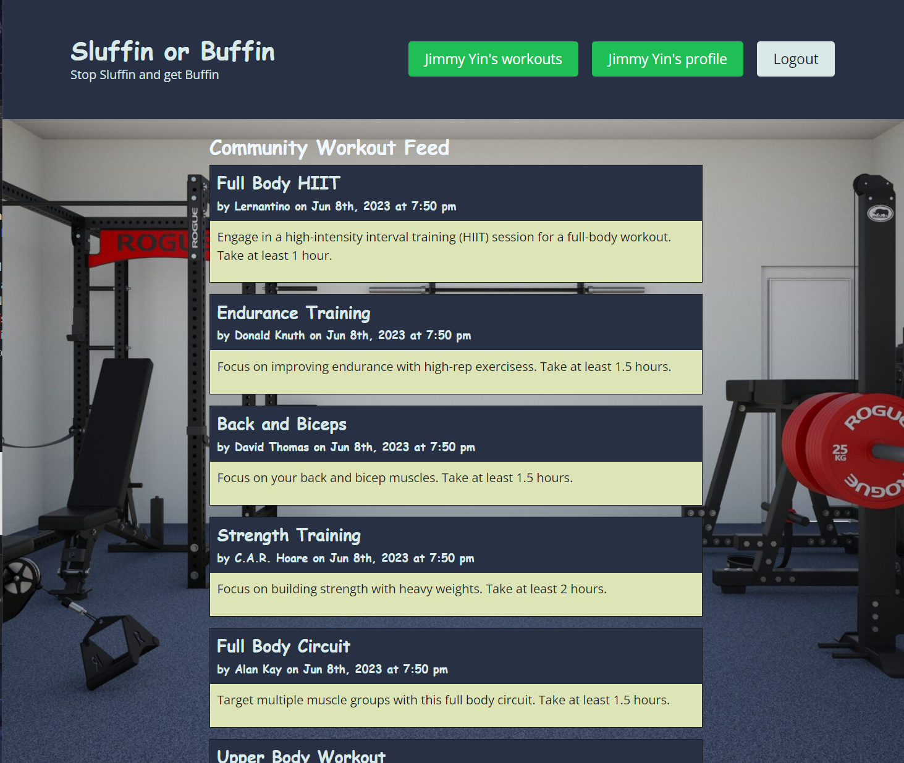
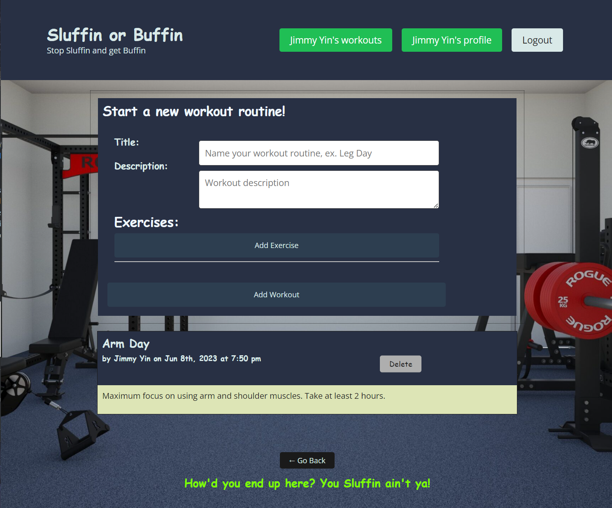

# Sluffin Or Buffin

## Description 

-When you have created an account, this enables you to enter your stats, goals and comment on others work out log in the news feed!

-Create your workouts that suits your goal!: 

-Authenticated users can create workout plans, such as choosing exercises, sets, reps, and weights amount.

-Track your workouts: Users can record their workout sessions,see the exercises performed.

-View you workout history: Users can view their workout history, tracking thier progress over time.

## Table of Contents 
  
- [Installation](#installation)
- [Usage](#usage)
- [Credits](#credits)
- [Features](#features)
- [Collaborators](#collaborators)

## Installation

Some installation packages is needed to run this application in command-line.

Please be sure to have the following installed prior to running this application:

-Install node version v16.18.0 by following instructions here:

https://coding-boot-camp.github.io/full-stack/nodejs/how-to-install-nodejs

## Usage

-Access application in terminal.

-Run the following command in terminal:

`npm i

npm run seed

npm run develop`

Please view the link below to use the deployed application:

<a href="https://salty-spire-29612.herokuapp.com/">Sluffin Or Buffin</a>

    

## Technologies Used

React, NodeJS, MongoDb Atlas, GraphQL

## Credits

Node.js - https://nodejs.org/en/

EXPRESS - https://expressjs.com/en/starter/installing.html

https://mongoosejs.com/

https://react.dev/learn

https://stackoverflow.com/

MERN UW BOOTCAMP COURSE

Tutoring

https://graphql.org/

https://devcenter.heroku.com/

https://www.apollographql.com/docs/react/data/mutations/

https://cloud.mongodb.com/

## Features

-Add , edit, delete work outs in your profile.

-Join the community of people working out like you.

-Comment on others progress to motivate or give recognition on thier hard work!

-Built in timer on your work out page.

## Collaborators:

<a href="https://github.com/xKranze">Jimmy Yin</a> 

<a href="https://github.com/bg2398">Brandon Guerrero</a> 

<a href="https://github.com/palhambra">Paolo Alhambra</a> 

<a href="https://github.com/isaacp5454">Isaac Park</a>

